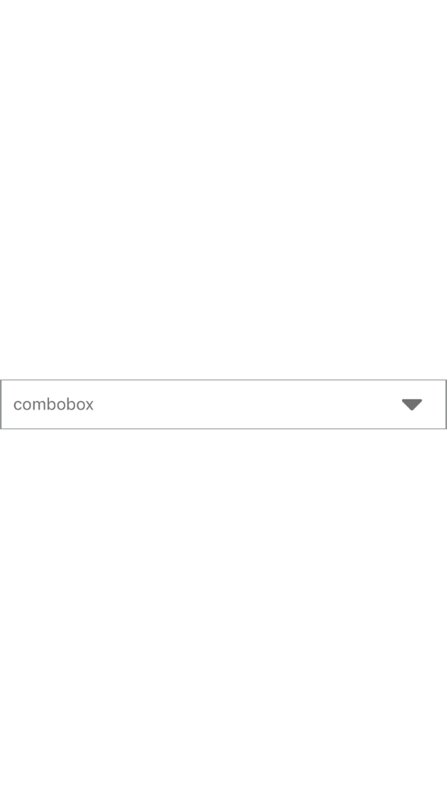
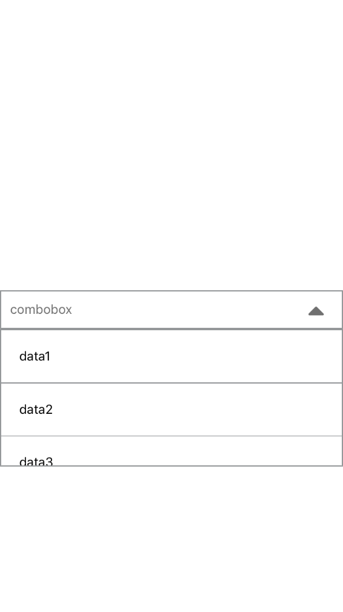

<!DOCTYPE html>
<html>
<head>

<meta charset="UTF-8">
<title>combobox react native</title>
</head>
<body>

  combobox react native

 

 

 
<h4> required install   react-native-vector-icons</h4>
<a href="https://www.npmjs.com/package/react-native-vector-icons"> react-native-vector-icons</a>
<pre class="editor editor-colors">

npm i react-native-vector-icons

</pre>
 
<h2>List option</h2>

<table>
  <tr>
    <th>property</th>
    <th>type</th>
    <th>description</th>
  </tr>
  <tr>
    <td>data</td>
    <td>list </td>
    <td>list  example
     [
 
    { "id": 1, "name": "data1" },
    { "id": 2, "name": "data2" },
    { "id": 3, "name": "data3" },
    { "id": 4, "name": "data4" },
    { "id": 5, "name": "data5" },
    ]

  </tr>
  <tr>
    <td>title</td>
    <td>string </td>
    <td>name combobox</td>
  </tr>
   <tr>
    <td>styleItem</td>
    <td>style css </td>
    <td>modifier style Item</td>
  </tr>
  <tr>
    <td>itemText</td>
    <td>style css </td>
    <td>applique style sur text items</td>
  </tr>
 
</table>
 
<h2>Example code</h2>
<pre class="editor editor-colors">

import React, {Component} from 'react';
import {Platform, StyleSheet,View} from 'react-native';
import Combobox  from 'combobox-react-native'
import data from './data'
const instructions = Platform.select({
  ios: 'Press Cmd+R to reload,\n' + 'Cmd+D or shake for dev menu',
  android:
    'Double tap R on your keyboard to reload,\n' +
    'Shake or press menu button for dev menu',
});

export default class App extends Component {
  render() {
    return (
      <View
        style={{
          flex: 1,
          marginTop: 10,
          justifyContent: "center",
          alignItems: "center"
        }} >
          <Combobox data={data}title='hello' />

      </View>

    );

  } 
}

</pre>
</pre>

</body>

</html>
